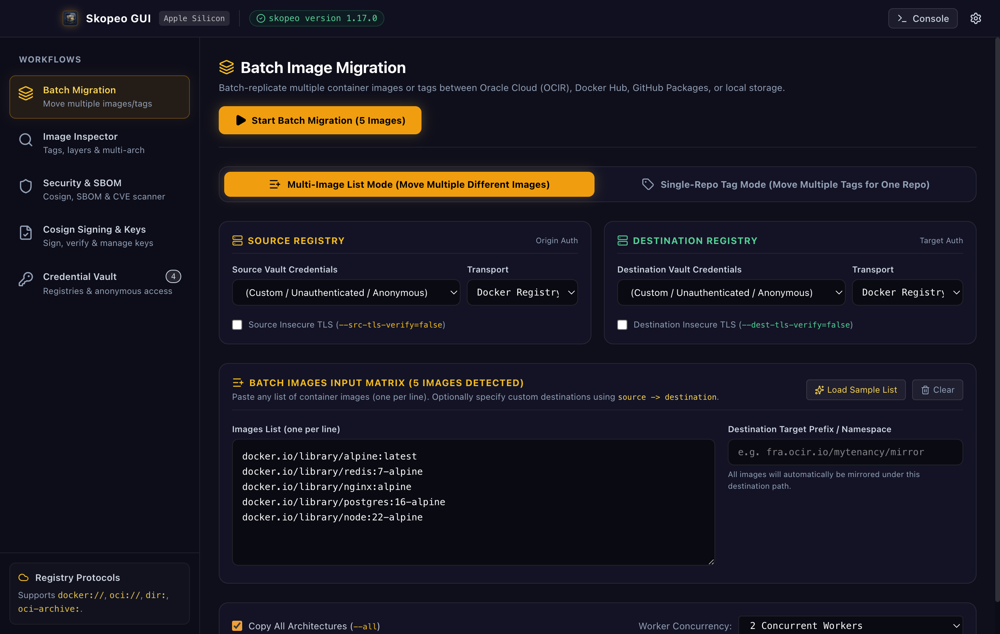
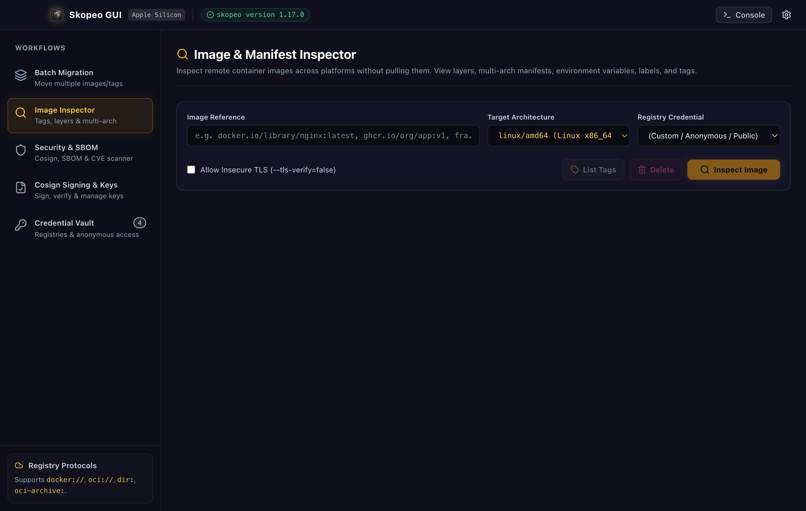
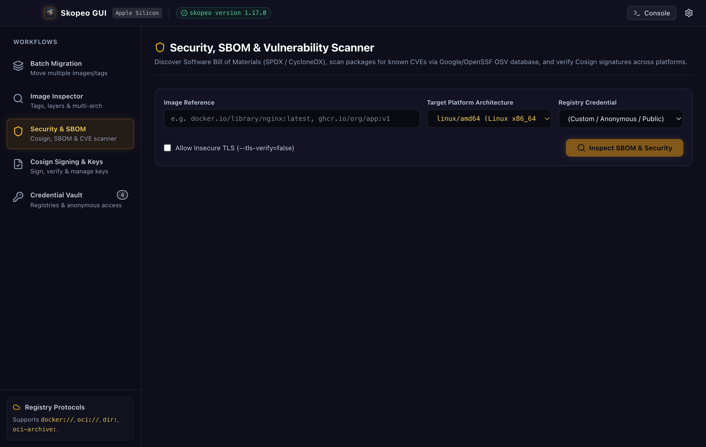
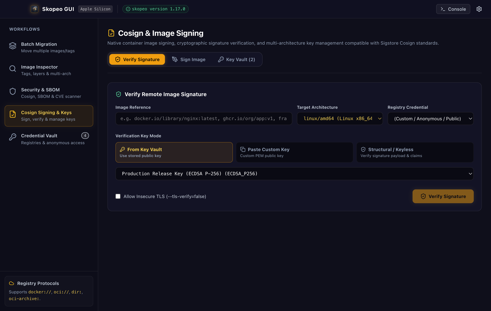
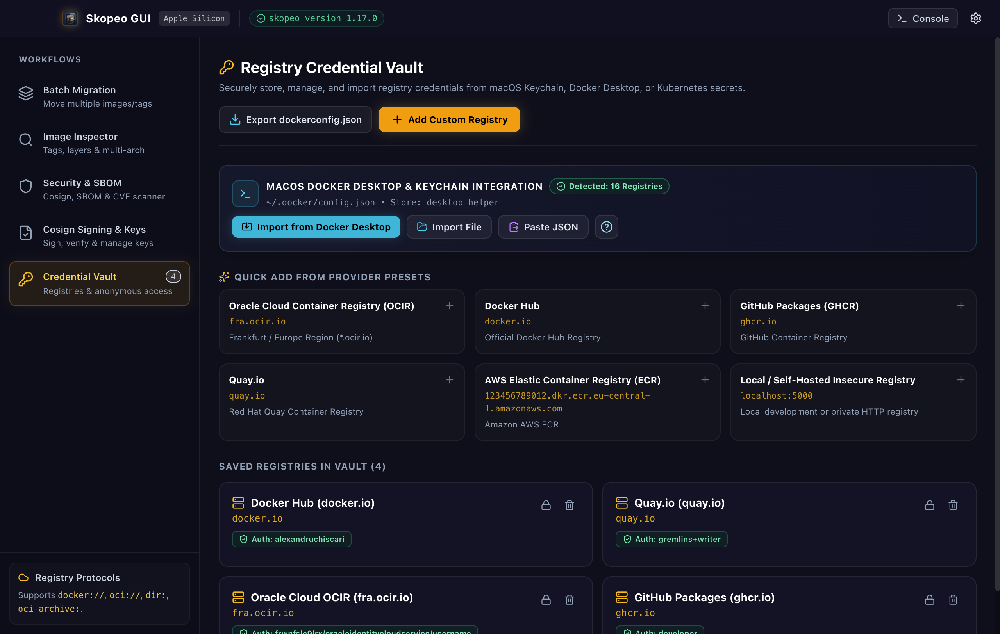

# Skopeo GUI for Mac (Apple Silicon / arm64)

<div align="center">
  
  <h3>Native macOS Desktop Interface for Container Migration, Multi-Arch Inspection, Cosign Signing & Vulnerability Auditing</h3>

  <p>
    <a href="#-quick-start--installation">Installation</a> •
    <a href="#1--batch-container-migration">Batch Migration</a> •
    <a href="#2--remote-image--multi-arch-inspector">Image Inspector</a> •
    <a href="#3-️-security-sbom--cve-vulnerability-scanner">Vulnerability Scanner</a> •
    <a href="#4-️-sigstore-cosign-signing--verification">Cosign Signing</a> •
    <a href="#5--credential-vault--macos-docker-integration">Credential Vault</a>
  </p>
</div>

---

## ⚡ Quick Start & Installation

### Requirements
- **macOS** on Apple Silicon (`arm64` — M1, M2, M3, M4)
- **Skopeo CLI** (installed via Homebrew):
  ```bash
  brew install skopeo
  ```

### Download & Install
1. Download the latest `.dmg` installer from [**GitHub Releases**](https://github.com/adynetro/skopeo-gui/releases/latest).
2. Open the `.dmg` file and drag **Skopeo GUI** into your **Applications** folder.


---

## 📖 Usage Guide

### 1. 🚀 Batch Container Migration

Migrate single or multiple container images across registries (Docker Hub, Oracle Cloud OCIR, GitHub GHCR, Quay, AWS ECR, or local directories) with parallel workers.

<div align="center">
  
</div>

#### How to Use:
1. **Choose Mode:**
   - **Multi-Image Matrix:** Paste a list of source images (`src` or `src -> dest`). Set a common **Destination Repo Prefix** (e.g. `docker.io/myorg`) to automatically route all images.
   - **Tag Discovery Mode:** Enter a repository (e.g. `docker.io/library/redis`), click **Fetch Tags**, and select specific versions to copy.
2. **Select Transports & Credentials:**
   - Choose protocols for source and destination: `docker://` (Remote Registry), `oci://` (Local OCI layout), `dir:` (Filesystem directory), or `docker-archive:` (`.tar` file).
   - Select saved credentials from your vault for private registries.
3. **Configure Options:**
   - **Copy All Architectures (`--all`):** Preserves multi-architecture manifest lists across all CPU architectures.
   - **Concurrency (1–8):** Run multiple migrations simultaneously with real-time progress bars.
4. Click **Start Batch Migration**.

---

### 2. 🔍 Remote Image & Multi-Arch Inspector

Inspect remote manifests, layers, environment variables, labels, and tags without pulling large images to your local disk.

<div align="center">
  
</div>

#### How to Use:
1. Enter an **Image Reference** (e.g. `docker.io/library/nginx:latest` or `ghcr.io/org/repo:v1`).
2. Select your **Target Architecture** (e.g. `linux/amd64`, `linux/arm64`).
3. Click **Inspect Image**:
   - **Overview:** View manifest type, creation date, Docker engine version, and multi-arch variants.
   - **Layers:** Inspect individual filesystem layer SHA256 digests.
   - **Env & Labels:** Inspect container environment variables and metadata.
   - **Tags:** Discover all available tags for the repository.
   - **Architectures:** Switch between CPU architecture platforms (`amd64`, `arm64`, `s390x`, `ppc64le`) with 1 click.

---

### 3. 🛡️ Security, SBOM & CVE Vulnerability Scanner

Audit container supply chain security, extract Software Bill of Materials (SBOM), and perform live CVE vulnerability scans using the Google/OpenSSF OSV database.

<div align="center">
  
</div>

#### How to Use:
1. Enter an image reference and click **Inspect SBOM & Security**.
2. **Supply Chain Verification:** Instant check for detached **Cosign signatures** (`.sig`), **SBOM artifacts** (`.sbom`), and **in-toto attestations** (`.att`).
3. **Run Vulnerability Scan:** Click **Start Vulnerability Scan** to query the OSV.dev database:
   - Evaluates exact mathematical **CVSS v3.1 / v3.0 / v4.0** base scores.
   - Categorizes vulnerabilities into **Critical**, **High**, **Medium**, and **Low**.
   - Displays recommended **remediation fix versions** (e.g. `Fixed in >= 3.1.6`).
   - Filter by severity or search by CVE ID and package name.

---

### 4. ✍️ Sigstore Cosign Signing & Verification

Sign and verify container images directly using the standard Sigstore OCI SimpleSigning format without installing the external `cosign` binary.

<div align="center">
  
</div>

#### How to Use:
- **Key Vault:** Generate password-protected **ECDSA P-256** or **Ed25519** signing key pairs, or import existing PEM keys.
- **Sign Image:** Select a private key from your vault, add optional key-value annotations (`git-sha`, `env=prod`), and click **Sign Image Digest**. The signature is pushed to `<repo>:sha256-<digest>.sig`.
- **Verify Signature:** Enter an image reference and public key to verify signature validity, signer identity, payload claims, and X.509 certificate data.

---

### 5. 🔑 Credential Vault & macOS Docker Integration

Store registry credentials safely with machine-bound AES-256-CBC encryption and seamlessly sync with Docker Desktop and Kubernetes secrets.

<div align="center">
  
</div>

#### How to Use:
- **1-Click Docker Desktop Import:** Automatically discovers your `~/.docker/config.json` and decrypts all credentials stored in your **macOS Keychain** (`docker-credential-desktop` / `osxkeychain`).
- **Import File / Paste JSON:** Import custom `.dockerconfigjson` files or paste base64 Kubernetes secret payloads.
- **Export dockerconfig.json:** Export all credentials to a standard `dockerconfig.json`, Kubernetes `ImagePullSecret` YAML, or base64 token.
- **Quick Provider Presets:** 1-click templates for **Oracle Cloud OCIR**, **Docker Hub**, **GitHub Packages (GHCR)**, **Quay.io**, **AWS ECR**, and **Local Insecure Registries**.

---

## 🛠️ Development

```bash
# Clone the repository
git clone https://github.com/adynetro/skopeo-gui.git
cd skopeo-gui

# Install dependencies
npm install

# Run in development mode (Vite + Electron live-reload)
npm run app:dev

# Build production bundle & standalone DMG installer
npm run dist:dmg
```

---

## 📄 License
MIT © [Alexandru Chiscari](https://github.com/adynetro)

