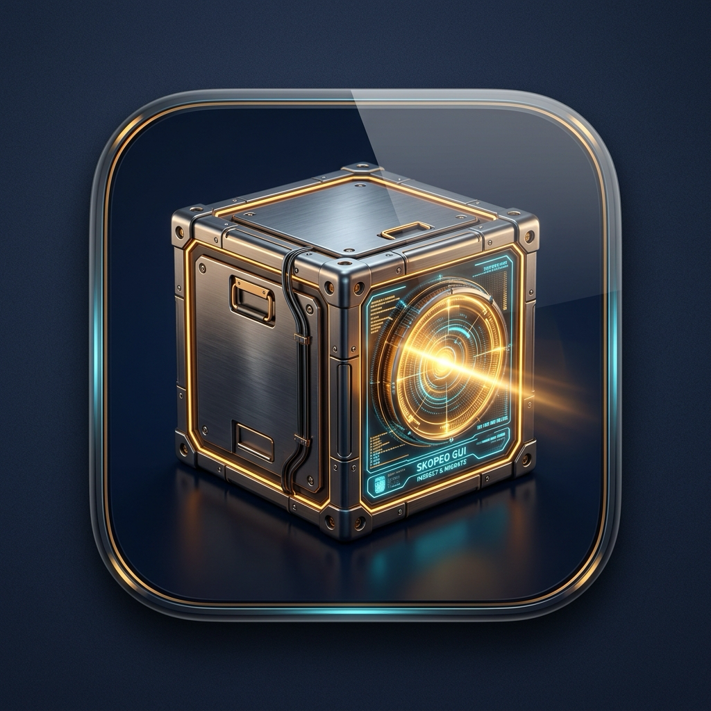

# Skopeo GUI for Mac (Apple Silicon / arm64)

<div align="center">
  
  <h3>Native macOS Desktop Interface for Container Image Migration, Multi-Arch Inspection & Vulnerability Auditing</h3>

  <p>
    <a href="#key-features">Features</a> •
    <a href="#vulnerability-scanning--cve-auditing">Vulnerability Scanner</a> •
    <a href="#security--sbom-inspector">SBOM & Security</a> •
    <a href="#multi-architecture-selector">Multi-Arch</a> •
    <a href="#batch-migration">Batch Migration</a> •
    <a href="#installation--requirements">Installation</a>
  </p>
</div>

---

A modern native macOS GUI application for **[Skopeo](https://github.com/containers/skopeo)** designed specifically for Apple Silicon (M1/M2/M3/M4) Macs.

Seamlessly **batch-migrate container images** across registries (Oracle Cloud OCIR, Docker Hub, GitHub Packages, Quay.io, AWS ECR, GCP Artifact Registry, or self-hosted registries), perform **live vulnerability scans** against the Google/OpenSSF OSV database, inspect **Software Bill of Materials (SBOM)** and **Cosign signatures**, and explore **multi-architecture manifests** with zero heavy daemon dependencies.

---

## Key Features

### 1. 🛡️ Live Vulnerability & CVE Scanner (Google / OpenSSF OSV Engine)
- **Zero-Binary Dependencies**: Directly queries the Open Source Vulnerabilities (OSV.dev) database (aggregating NVD, GitHub Advisory Database, Alpine/Debian security trackers, and ecosystem databases).
- **1-Click Scanning**: Scan all discovered SBOM packages (`apk`, `deb`, `rpm`, `npm`, `pypi`, `golang`, `cargo`, `maven`, `nuget`, etc.) for known CVEs.
- **Severity Breakdown**: Color-coded categorization into **Critical**, **High**, **Medium**, and **Low** risks with CVSS vector scores.
- **Automated Remediation Fixes**: Displays recommended fix versions (e.g. `Fixed in >= 3.1.6`).
- **Interactive Filtering & Search**: Instant real-time filtering by severity level, CVE ID, or package name.
- **JSON Report Export**: Download structured vulnerability audit reports with a single click.

---

### 2. ✍️ Cosign Signing, Verification & Key Vault
- **Native Zero-Binary Signing**: Sign any remote container image digest without pulling full images, using Node.js built-in `crypto` engine.
- **Sigstore OCI Standard**: Pushes standard `sha256-<digest>.sig` simple signing artifacts compatible with official `cosign verify`.
- **Key Pair Management**: 1-click generation of **ECDSA P-256** and **Ed25519** key pairs stored securely in the encrypted macOS machine vault.
- **Custom Claims & Annotations**: Add metadata (e.g. `git-sha`, `build-id`, `release-env`, `author`) to signatures.
- **Cryptographic Verification**: Verify signatures against stored keys, custom PEM public keys, or structural/Keyless payload claims.
- **Export & Download**: Export `cosign.pub` and `cosign.key` files for CI/CD pipelines.

---

### 3. 📦 Security & SBOM Inspector (SPDX, CycloneDX & Cosign)
- **SBOM Detection**: Discovers detached OCI SBOM artifacts (`.sbom` tags), inline SPDX / CycloneDX metadata, and container label definitions.
- **Supply Chain Cryptographic Verification**: Probes for **Cosign signatures** (`.sig` tags) and SLSA / in-toto **attestations** (`.att` tags).
- **Package Inventory Browser**: Inspect all installed packages, licenses, suppliers, and Package URLs (PURLs).
- **Raw OCI Manifests**: View and copy full JSON manifest representations.

---

### 3. 🖥️ Multi-Architecture Platform Selector & Inspector
- **Preset Architecture Targeting**: Inspect container images and SBOMs for specific platform architectures (defaulting to **`linux/amd64`** for cloud servers or **`linux/arm64`** for Apple Silicon / ARM servers).
- **Automatic Multi-Arch Discovery**: Detects all platforms within OCI / Docker manifest lists (`linux/amd64`, `linux/arm64`, `linux/arm/v7`, `linux/ppc64le`, `linux/s390x`, `windows/amd64`).
- **1-Click Platform Switcher**: Switch between architectures on the fly to inspect layer digests and vulnerabilities specific to each platform variant.

---

### 4. 🚀 Batch Image & Tag Migration
- **Multi-Image Matrix Mode**: Migrate lists of source images (`src -> dest`) with automatic destination repo prefix routing (e.g., mirror images into an Oracle Cloud OCIR tenancy).
- **Tag Mode**: Discover all published tags for a repository and batch-copy selected versions.
- **Multi-Transport Support**:
  - `docker://` (Remote Docker / OCI registries)
  - `oci://` (Local OCI directory format)
  - `dir:` (Local unpacked filesystem directories)
  - `oci-archive:` & `docker-archive:` (Single-file container tarballs)
  - `docker-daemon:` (Local Docker daemon socket)
- **Full Multi-Architecture Mirroring**: Toggle `--all` to copy all architecture variants in multi-arch images.
- **Concurrent Worker Pool**: Parallel transfers (1 to 8 concurrent workers) with individual progress bars and cancellation support.

---

### 5. 🔑 Encrypted Credential Vault
- **Machine-Bound AES-256 Encryption**: Securely store registry passwords and API tokens on macOS.
- **Anonymous / Public Mode**: Pull and copy from open/public registries without authentication.
- **Insecure TLS Bypasses**: Toggle `--tls-verify=false` per registry for local development / testing.
- **1-Click Registry Presets**:
  - **Oracle Cloud Infrastructure Registry (OCIR)** (`fra.ocir.io`, `iad.ocir.io`, `phx.ocir.io`, etc.)
  - **Docker Hub** (`docker.io`)
  - **GitHub Container Registry (GHCR)** (`ghcr.io`)
  - **Quay.io** (`quay.io`)
  - **AWS ECR** (`*.dkr.ecr.*.amazonaws.com`)
  - **Local / Self-Hosted Registry** (`localhost:5000`)
- **Docker Config Importer**: Automatically import credentials from `~/.docker/config.json`.
- **Live Connection Test**: Verify registry authentication before saving.

---

### 6. 🔍 Remote Image & Tag Management
- **Remote Manifest Inspection**: Query layers, digests, sizes, env variables, and labels without pulling images.
- **Tag Discovery**: Discover and filter all published tags for any remote repository.
- **Remote Image Deletion**: Delete tags and manifests directly from remote registries via Skopeo.

---

### 7. 📟 Real-Time Terminal Console
- Live streaming output of all underlying Skopeo CLI commands with syntax highlighting, log levels, copy buttons, and autoscroll.

---

## Installation & Requirements

### Requirements
- **macOS** on Apple Silicon (`arm64` - M1, M2, M3, M4)
- **Skopeo CLI** (automatically detected at `/opt/homebrew/bin/skopeo` or PATH):
  ```bash
  brew install skopeo
  ```

### Pre-built App & DMG
The build outputs are located in:
- **DMG Installer:** `release/Skopeo GUI-1.0.0-arm64.dmg`
- **Application Bundle:** `release/mac-arm64/Skopeo GUI.app`

---

## Development

```bash
# Clone repository
git clone https://github.com/adynetro/skopeo-gui.git
cd skopeo-gui

# Install dependencies
npm install

# Start in development mode (Vite + Electron live-reload)
npm run app:dev

# Build production frontend and Electron main
npm run build && npm run build:electron

# Package standalone macOS Apple Silicon DMG installer
npm run dist:dmg
```

---

## Project Structure

```
skopeo-gui/
├── src/
│   ├── main/
│   │   ├── index.ts                # Electron main entry & IPC handlers
│   │   ├── skopeo.ts               # Skopeo CLI wrapper service (multi-arch, SBOM, copy, delete)
│   │   ├── cosign.ts               # Native Cosign signing & verification service
│   │   ├── vulnerabilityScanner.ts # OSV.dev batch vulnerability scanner
│   │   ├── credentials.ts          # Encrypted credential storage service
│   │   └── batchRunner.ts          # Concurrent worker pool for batch transfers
│   ├── preload/
│   │   └── index.ts                # Electron IPC context bridge
│   ├── renderer/
│   │   ├── src/
│   │   │   ├── components/
│   │   │   │   ├── CosignManager.tsx      # Cosign image signing, verify & key vault UI
│   │   │   │   ├── SbomInspector.tsx      # Security, SBOM & CVE scanner UI
│   │   │   │   ├── ImageInspector.tsx     # Image, multi-arch & tag inspector
│   │   │   │   ├── BatchTransfer.tsx      # Multi-image & tag batch transfer UI
│   │   │   │   ├── CredentialManager.tsx  # Encrypted credential vault UI
│   │   │   │   ├── TerminalLogs.tsx       # Live terminal console drawer
│   │   │   │   ├── TitleBar.tsx           # Custom macOS titlebar
│   │   │   │   └── Sidebar.tsx            # Navigation workflows
│   │   │   ├── App.tsx                    # Main React application
│   │   │   └── main.tsx                   # React entry point
│   └── types/
│       └── index.ts                # Shared TypeScript interfaces
├── build/
│   ├── icon.icns                   # macOS Application Icon
│   └── icon.png                    # High-res App Icon
└── release/                        # Packaged macOS DMG & App bundle
```

---

## License
MIT © [Alexandru Chiscari](https://github.com/adynetro)
